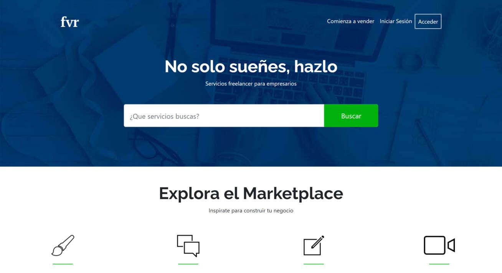

# Copy of the page Fiverr

This project is a static layout inspired by the design of the Fiverr page. It's built with HTML, CSS, and JavaScript to provide a similar visual experience.You can view the demo [here](https://iaosan.github.io/frv-layout/).

## Screenshots



## Setup

Follow these steps to install and run the project on your local machine.

**1. Clone the repository:**

```
git clone https://github.com/IAOsan/bienes-raices-layout.git
cd fvr-layout
```

**2. Install dependencies:**  
Ensure you have Node.js and npm installed on your machine. Then, run:

```
npm install
```

**3. Compile the project**  
This command will compile PUG and SASS and start a local server with Browser-Sync.

```
npm run start
```

Or you can compile the project in watch mode. This command will use Concurrently to run Pug and Sass compilation scripts in watch mode, in addition to starting a local server with Browser-Sync.

```
npm run dev
```

## Usage

This project is currently a static layout and does not include interactive functionalities. You can explore different sections and preview the Fiverr-like design, but please note that there are no dynamic interactions or fully implemented features in this version.

## Technologies Used

#### Core Technologies

- Pug
- Bootstrap - version 4
- Sass

#### Development Dependencies

- concurrently - version 8.2.2
- sass - version 1.69.7
- pug-cli - version 1.0.0-alpha6
- browser-sync - version 2.29.3

## Acknowledgments

This project was developed based on a course taught by [Juan Pablo De la Torre Valdez (codigoconjuan)](https://github.com/codigoconjuan).
